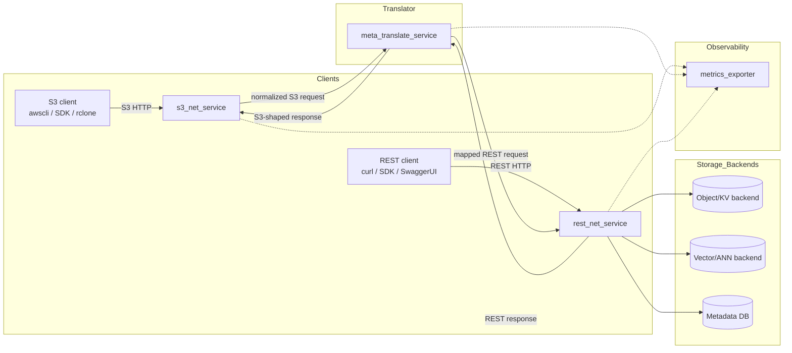
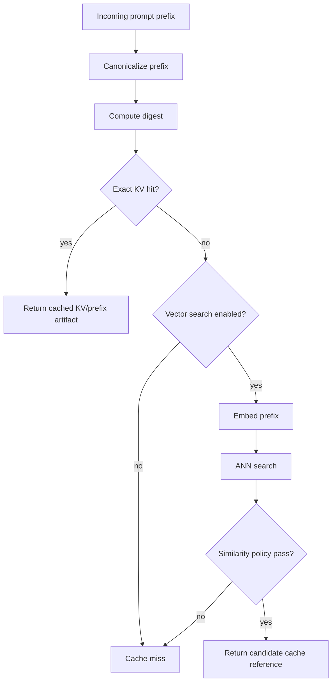

# ADR-022: S3-Object to REST-API Protocol Mapping Translator

**Project:** Project Coherent Storage  
**Sub-focus:** Key-Value Vector Database operations with LLM Prompt Prefix Caching  
**Version:** 2026-Q2.v4  
**Status:** Proposed  
**Generated:** 2026-05-17

## Decision summary

Define a Python-based, POSIX-portable protocol translation layer that accepts S3 object-protocol requests, maps them to an internal REST API, and exposes equivalent REST-native operations for CRUD, key/value, vector, and LLM prompt-prefix cache workflows.

The system is composed of four independently supervised services:

1. `s3_net_service`: HTTP listener for S3-compatible object API traffic.
2. `meta_translate_service`: S3-to-REST and REST-to-S3 command translator with configurable metadata persistence.
3. `rest_net_service`: REST API surface for object, key/value, vector, and prefix-cache operations.
4. `metrics_exporter`: Prometheus-compatible observability endpoint.

SystemD is explicitly excluded. Services must run under POSIX-compatible supervision on FreeBSD and Linux using `daemon(8)`, rc scripts, `supervisord`, `runit`, `s6`, container entrypoints, or similar process managers.

## Context

Project Coherent Storage already treats inference actors as clients of a governed cache/storage control plane rather than direct consumers of lower-layer storage internals. This ADR adds an access-layer translator that allows existing S3 tooling and direct REST clients to operate against the same logical object/key/value/vector namespace.

The immediate target is LLM prompt-prefix caching:

- Exact key/value lookup for deterministic prefix reuse.
- Optional vector/ANN lookup for prefix-similarity discovery.
- Metadata capture for request path, translation decisions, cache hits, cache misses, latency, object identity, and debugging.
- Modular persistence so the backend can start as a file-backed prototype and later move to Redis/Valkey, Dragonfly, Coherence CE, OpenSearch, Milvus, FAISS, or another implementation.

## Decision

Adopt a translator architecture where S3 and REST are ingress protocols, but object and cache semantics converge in a single REST-facing backend contract.



## Required protocol coverage

### S3 object operations

The translator design covers the S3 object API surface rather than only the minimum object CRUD subset.

| Category | Operations |
| --- | --- |
| Bucket lifecycle | `ListBuckets`, `CreateBucket`, `DeleteBucket`, `HeadBucket` |
| Object CRUD | `PutObject`, `GetObject`, `HeadObject`, `DeleteObject`, `DeleteObjects` |
| Object listing | `ListObjects`, `ListObjectsV2`, `ListObjectVersions` |
| Object copy | `CopyObject`, `UploadPartCopy` |
| Multipart upload | `CreateMultipartUpload`, `UploadPart`, `ListParts`, `CompleteMultipartUpload`, `AbortMultipartUpload` |
| Object metadata | `x-amz-meta-*`, content headers, ETag, object length, last-modified |
| Object tagging | `GetObjectTagging`, `PutObjectTagging`, `DeleteObjectTagging` |
| Versioning hooks | `versionId`-aware get/head/delete/list semantics where backend support exists |
| Byte range | `Range` header support for partial object reads |

### REST operations

The REST interface exposes object, key/value, vector, and prefix-cache functionality using JSON control payloads and binary object bodies.

| REST endpoint family | Purpose |
| --- | --- |
| `/buckets` | Bucket list/create lifecycle |
| `/buckets/{bucket}` | Bucket metadata and object listing |
| `/objects/{bucket}/{key}` | Object CRUD and metadata |
| `/objects/{bucket}/{key}/tags` | Object tag lifecycle |
| `/objects/{bucket}/{key}/multipart` | Multipart session lifecycle |
| `/kv/{namespace}/{key}` | Direct key/value read/write/delete |
| `/vectors/{namespace}` | Vector upsert/search/delete |
| `/prefix-cache/{namespace}` | LLM prompt-prefix cache put/get/search/invalidate |
| `/translate/s3-to-rest` | Explicit S3-to-REST translation inspection |
| `/translate/rest-to-s3` | Explicit REST-to-S3 translation inspection |
| `/healthz` | Service health |
| `/metrics` | Prometheus-compatible metrics |

## S3-to-REST mapping model

The meta service must map S3 wire operations into a normalized command envelope before calling REST.

```json
{
  "request_id": "req-20260517-000001",
  "direction": "s3_to_rest",
  "s3_operation": "PutObject",
  "rest_operation": "putObject",
  "method": "PUT",
  "bucket": "llm-prefix-cache",
  "key": "tenant-a/model-x/prefix/sha256-abcd",
  "query": {},
  "headers": {
    "content-type": "application/octet-stream",
    "x-amz-meta-cache-kind": "prefix-kv"
  },
  "metadata_mode": "minimal"
}
```

The REST API response is then translated back into an S3-shaped response for S3 clients, including expected status codes, headers, XML list/error payloads where needed, ETag handling, and S3-compatible metadata projection.

## Metadata persistence modes

Metadata persistence is modular and configurable.

| Mode | Intended use | Stored fields |
| --- | --- | --- |
| `off` | Maximum throughput local testing | Request counters only |
| `minimal` | Default production path | Request ID, timestamp, operation, bucket/key hash, status, latency, byte counts |
| `standard` | Operations and debugging | Minimal fields plus caller IP, selected headers, REST mapping decision, cache hit/miss |
| `verbose` | Deep debugging | Full normalized request, full normalized response, selected payload digests, error traces |
| `forensic` | Controlled lab-only diagnosis | Full headers and bounded body capture with explicit redaction rules |

Verbose and forensic modes must support explicit redaction for authorization headers, cookies, credentials, tenant secrets, and object payloads.

## LLM prompt-prefix cache model

The design supports two cache lookup classes:

1. **Exact KV prefix cache**: deterministic lookup by prefix digest.
2. **Vector/ANN prefix cache**: similarity lookup by embedding vector where exact digest misses.



The REST backend must not hard-code any single database. It must use a backend interface with replaceable implementations.

```python
class CacheBackend:
    def put_object(self, bucket: str, key: str, data: bytes, metadata: dict) -> dict: ...
    def get_object(self, bucket: str, key: str, byte_range: str | None = None) -> bytes: ...
    def head_object(self, bucket: str, key: str) -> dict: ...
    def delete_object(self, bucket: str, key: str) -> None: ...

    def put_kv(self, namespace: str, key: str, data: bytes, metadata: dict) -> dict: ...
    def get_kv(self, namespace: str, key: str) -> bytes | None: ...

    def upsert_vector(self, namespace: str, vector_id: str, vector: list[float], metadata: dict) -> dict: ...
    def search_vector(self, namespace: str, vector: list[float], top_k: int) -> list[dict]: ...

    def put_prefix_cache(self, namespace: str, prefix_id: str, artifact: bytes, metadata: dict) -> dict: ...
    def get_prefix_cache(self, namespace: str, prefix_id: str) -> bytes | None: ...
```

## Service supervision decision

Use POSIX-compatible service execution only.

Accepted supervision mechanisms:

- FreeBSD `rc.d` scripts.
- FreeBSD `daemon(8)`.
- Linux SysV init scripts.
- `supervisord`.
- `runit`.
- `s6`.
- Container entrypoints.
- Direct foreground execution for test labs.

Rejected mechanisms:

- systemd unit dependencies.
- journald-only logging.
- Linux-only service lifecycle APIs.
- cgroup-specific process assumptions in application code.

## Security and compatibility decisions

- Support unsigned mode for trusted lab deployments.
- Support AWS Signature Version 4 verification as an optional front-door compatibility mode.
- Persist object metadata from `x-amz-meta-*` headers.
- Render S3 XML errors for S3 clients.
- Return JSON problem/error payloads for REST clients.
- Avoid storing authorization material in metadata persistence unless explicitly enabled by a lab-only forensic configuration.

## Acceptance criteria

- All services start as ordinary Python processes on FreeBSD and Linux without systemd.
- S3 CRUD, listing, copy, tagging, metadata, byte-range, versioning hooks, and multipart workflow are represented in the REST mapping table.
- OpenAPI schema documents object, KV, vector, prefix-cache, translation, health, and metrics endpoints.
- Swagger UI is reachable behind nginx.
- Metadata persistence is mode-configurable from `off` through `forensic`.
- Prometheus can scrape metrics for request totals, latency histograms, byte counts, translation errors, cache hits, cache misses, and backend errors.
- Backend interface allows replacement of the object/KV/vector/prefix-cache database without rewriting protocol services.

## Consequences

### Positive

- Existing S3 tooling can interact with the same cache/storage namespace as REST-native clients.
- LLM prompt-prefix cache workflows can start as exact KV and evolve into vector-assisted lookup.
- S3-specific response shaping is isolated at the edge rather than embedded throughout the backend.
- The design remains portable across FreeBSD and Linux.

### Negative

- Full S3 compatibility is broad; edge cases around signing, XML response fidelity, multipart state, versioning, conditional headers, and error semantics require conformance testing.
- Vector-assisted prefix reuse requires strict correctness policy; similarity hits must not be treated as safe reuse unless the model/runtime semantics allow it.
- Verbose metadata modes can leak sensitive material unless redaction is enforced.

### Deferred

- Full AWS SigV4 conformance suite.
- Backend-specific adapters for Redis/Valkey, Dragonfly, Coherence CE, Milvus, FAISS, OpenSearch, or file-backed object storage.
- Production admission policy for vector-similar prefix-cache reuse.
- Distributed multipart state coordination across translator replicas.

## Related files

- `reports/s3-object-rest-api-translator-design.md`
- `diagrams/s3-object-rest-translator-high-level.mmd`
- `diagrams/s3-object-rest-translator-request-flow.mmd`
- `diagrams/s3-object-rest-translator-prefix-cache.mmd`
- `openapi/s3-object-rest-translator.openapi.yaml`
- `src/s3-rest-translator/README.md`
- `src/s3-rest-translator/rest_net_service.py`
- `src/s3-rest-translator/s3_net_service.py`
- `src/s3-rest-translator/meta_translate_service.py`
- `src/s3-rest-translator/metrics_exporter.py`
- `src/s3-rest-translator/cache_backend.py`
- `src/s3-rest-translator/config.example.toml`
- `src/s3-rest-translator/nginx/translator.conf`
- `src/s3-rest-translator/supervisor/supervisord.conf`
