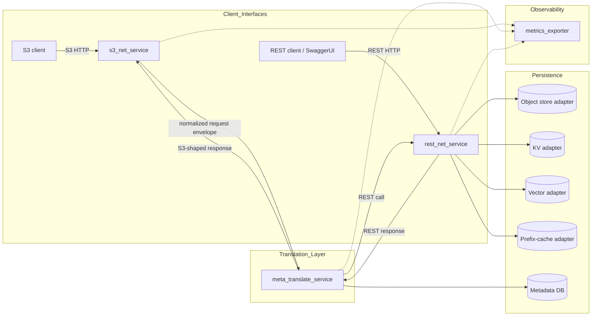
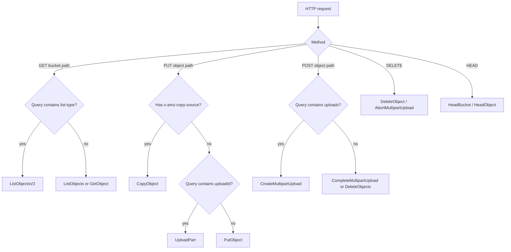
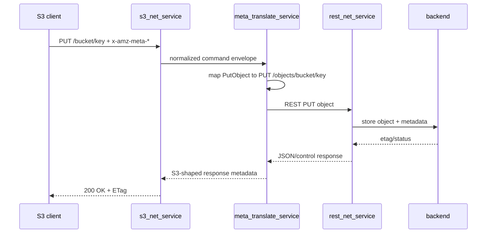
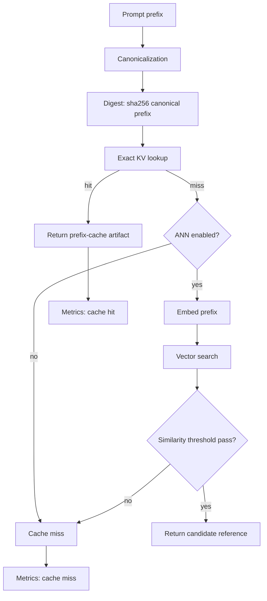

# S3-Object to REST-API Protocol Mapping Translator

**Sub-focus:** Key-Value Vector Database operations with LLM Prompt Prefix Caching  
**Project:** Project Coherent Storage  
**Status:** Proposed design package  
**Generated:** 2026-05-17

## 1. Purpose

This design defines a portable Python protocol translator that maps S3 object-protocol calls into REST API operations and exposes REST-native CRUD, key/value, vector, and LLM prompt-prefix-cache workflows.

The translator is intended as an access layer. It does not force any single persistence backend. Object storage, key/value storage, vector indexes, and prompt-prefix cache artifacts are accessed through modular backend adapters.

## 2. Non-negotiable constraints

- Python implementation.
- POSIX-compatible runtime model.
- FreeBSD and Linux support.
- No systemd dependency.
- No journald-only logging.
- No Linux-only service lifecycle assumptions.
- Swagger UI available through FastAPI and nginx.
- Prometheus-compatible metrics.

## 3. System services

| Service | Port example | Responsibility |
| --- | ---: | --- |
| `s3_net_service` | `8080` | S3-compatible HTTP ingress and S3 response shaping. |
| `meta_translate_service` | `9000` | Command translation, metadata persistence, bidirectional mapping inspection. |
| `rest_net_service` | `8000` | REST API for object, KV, vector, and prompt-prefix-cache operations. |
| `metrics_exporter` | `9100` | Prometheus-compatible metrics aggregation/export. |

## 4. High-level architecture



## 5. S3 object protocol summary

S3 object protocol is an HTTP object-store interface where the logical object identity is `{bucket}/{key}`. Semantics are conveyed by HTTP method, URI path, query parameters, and headers.

### 5.1 Core S3 operation set

| S3 category | Operations | Translation notes |
| --- | --- | --- |
| Bucket lifecycle | `ListBuckets`, `CreateBucket`, `DeleteBucket`, `HeadBucket` | Maps to `/buckets` and `/buckets/{bucket}`. |
| Object CRUD | `PutObject`, `GetObject`, `HeadObject`, `DeleteObject`, `DeleteObjects` | Maps to `/objects/{bucket}/{key}` and batch delete endpoint. |
| Listing | `ListObjects`, `ListObjectsV2`, `ListObjectVersions` | REST returns JSON; S3 response is rendered as XML where required. |
| Copy | `CopyObject` | S3 header `x-amz-copy-source` maps to JSON copy request. |
| Multipart | `CreateMultipartUpload`, `UploadPart`, `UploadPartCopy`, `ListParts`, `CompleteMultipartUpload`, `AbortMultipartUpload` | REST uses explicit multipart session paths. |
| Tags | `GetObjectTagging`, `PutObjectTagging`, `DeleteObjectTagging` | REST uses JSON tags; S3 uses XML tag set. |
| Metadata | `x-amz-meta-*`, content headers, ETag, length, last modified | Stored as object metadata and projected back to S3 headers. |
| Byte range | `Range` | REST accepts `Range` and returns partial byte stream. |
| Versioning hooks | `versionId` query behavior | Supported where backend adapter implements version state. |

### 5.2 S3 request classification



## 6. REST API summary

The REST API is the canonical backend contract.

### 6.1 Object endpoints

| Method | Path | Function |
| --- | --- | --- |
| `GET` | `/buckets` | List buckets. |
| `POST` | `/buckets` | Create bucket. |
| `GET` | `/buckets/{bucket}` | List objects. |
| `DELETE` | `/buckets/{bucket}` | Delete empty bucket. |
| `GET` | `/objects/{bucket}/{key}` | Download object. |
| `PUT` | `/objects/{bucket}/{key}` | Upload object. |
| `HEAD` | `/objects/{bucket}/{key}` | Return metadata. |
| `DELETE` | `/objects/{bucket}/{key}` | Delete object. |
| `PUT` | `/objects/{bucket}/{key}/copy` | Copy object. |
| `GET` | `/objects/{bucket}/{key}/tags` | Get object tags. |
| `PUT` | `/objects/{bucket}/{key}/tags` | Set object tags. |
| `DELETE` | `/objects/{bucket}/{key}/tags` | Delete object tags. |

### 6.2 KV, vector, and prompt-cache endpoints

| Method | Path | Function |
| --- | --- | --- |
| `PUT` | `/kv/{namespace}/{key}` | Store binary or JSON key/value artifact. |
| `GET` | `/kv/{namespace}/{key}` | Retrieve key/value artifact. |
| `DELETE` | `/kv/{namespace}/{key}` | Delete key/value artifact. |
| `POST` | `/vectors/{namespace}` | Upsert vector with metadata. |
| `POST` | `/vectors/{namespace}/search` | Search vector index. |
| `DELETE` | `/vectors/{namespace}/{vector_id}` | Delete vector record. |
| `PUT` | `/prefix-cache/{namespace}/{prefix_id}` | Store prompt-prefix cache artifact. |
| `GET` | `/prefix-cache/{namespace}/{prefix_id}` | Exact prefix-cache lookup. |
| `POST` | `/prefix-cache/{namespace}/search` | Vector-assisted prefix-cache lookup. |
| `DELETE` | `/prefix-cache/{namespace}/{prefix_id}` | Invalidate prefix-cache artifact. |

## 7. Bidirectional translation

### 7.1 S3 to REST



### 7.2 REST to S3-shape inspection

REST clients normally write directly to the same backend. When S3-shaped response inspection is needed, clients can use the translation endpoint.

```json
{
  "direction": "rest_to_s3",
  "rest_operation": "putObject",
  "method": "PUT",
  "path": "/objects/llm-prefix-cache/key-a",
  "desired_s3_operation": "PutObject"
}
```

## 8. Metadata persistence policy

| Mode | Runtime cost | Use case | Stored fields |
| --- | --- | --- | --- |
| `off` | Lowest | Benchmarking | Metrics counters only. |
| `minimal` | Low | Default production | Request ID, operation, status, latency, bytes, bucket/key digest. |
| `standard` | Moderate | Operational debugging | Minimal fields plus selected headers, caller address, mapping decision, cache hit/miss. |
| `verbose` | High | Lab diagnostics | Full normalized request/response envelopes, payload digests, backend timing. |
| `forensic` | Highest | Controlled fault reproduction | Bounded body capture and full headers with mandatory redaction. |

Required redactions:

- `Authorization`
- `Cookie`
- `Set-Cookie`
- `X-Amz-Security-Token`
- application secrets
- tenant credentials
- raw object payloads unless explicitly enabled

## 9. Prefix-cache design

LLM prompt-prefix caching is modeled as an artifact store with optional vector index sidecar.



### 9.1 Correctness boundary

Vector similarity is not automatically equivalent to safe KV-cache reuse. The backend must expose policy gates:

- exact-only mode;
- vector-search-for-advisory mode;
- vector-search-for-reuse mode only after model/runtime validation;
- per-model and per-tenant thresholds;
- invalidation on tokenizer, model, quantization, runtime, or prompt-template changes.

## 10. Metrics

Required metrics include:

```text
translator_requests_total{service,operation,status}
translator_request_latency_seconds_bucket{service,operation}
translator_bytes_in_total{service,operation}
translator_bytes_out_total{service,operation}
translator_translation_errors_total{direction,operation,error_class}
translator_cache_hits_total{namespace,cache_kind}
translator_cache_misses_total{namespace,cache_kind}
translator_backend_errors_total{backend,error_class}
translator_metadata_events_total{mode,event_kind}
```

## 11. Deployment model

### 11.1 Local lab startup

```bash
python -m venv .venv
. .venv/bin/activate
pip install -r requirements.txt
uvicorn rest_net_service:app --host 0.0.0.0 --port 8000
uvicorn meta_translate_service:app --host 0.0.0.0 --port 9000
uvicorn s3_net_service:app --host 0.0.0.0 --port 8080
uvicorn metrics_exporter:app --host 0.0.0.0 --port 9100
```

### 11.2 POSIX supervision

Use `supervisord`, `runit`, `s6`, FreeBSD rc scripts, FreeBSD `daemon(8)`, or container entrypoints. Application code must not depend on systemd APIs.

## 12. File map

| Path | Purpose |
| --- | --- |
| `adr/ADR-022_S3_Object_to_REST_API_Protocol_Mapping_Translator.md` | ADR record. |
| `reports/s3-object-rest-api-translator-design.md` | Main design report. |
| `diagrams/s3-object-rest-translator-*.mmd` | Mermaid diagrams. |
| `openapi/s3-object-rest-translator.openapi.yaml` | OpenAPI 3.0 schema. |
| `src/s3-rest-translator/*.py` | Python service skeletons and backend interface. |
| `src/s3-rest-translator/config.example.toml` | Example runtime configuration. |
| `src/s3-rest-translator/nginx/translator.conf` | nginx reverse proxy config. |
| `src/s3-rest-translator/supervisor/supervisord.conf` | POSIX-friendly service supervision example. |
