# Architecture Framework and Standards-Body Choice Workflow

**Date:** 2026-05-15  
**Status:** Reference workflow for Project Coherent Storage architecture planning  
**Scope:** High-level choice path for selecting architecture frameworks, standards bodies, and benchmark authorities during systems, network, database, and storage engineering design process-sequence modeling across rack, pod, datacenter, regional, and global scales.

## Executive rule

Do not choose a single universal framework. Use a layered stack:

1. **Architecture-governance spine**: ISO 42010 for stakeholder/viewpoint discipline, ADR/MADR for decision records, arc42/C4-style views for readable system documentation, and TOGAF/ITIL only when enterprise portfolio or service-lifecycle governance is in scope.
2. **Domain standards authority**: OCP, IEEE, IETF, UEC, IBTA/OFA, SNIA, NVMe, DMTF, Redfish, Swordfish, CXL, OpenConfig, and OpenTelemetry govern the engineering interfaces they actually define.
3. **Workload and benchmark evidence**: SPEC, MLCommons/MLPerf, TOP500/HPL, IO500, STAC, TPC/TPCx-HS, and project-local SLO tests prove whether the selected architecture satisfies its performance, durability, reliability, and operational claims.
4. **Project-local synthesis**: ADRs bind the above into explicit decisions, rejected alternatives, failure semantics, telemetry gates, and acceptance tests.

The output should be an architecture process-sequence pack, not a prose-only recommendation.

## PlantUML workflow

Standalone source file: `architecture-framework-standards-choice-workflow-2026-05-15.puml`.

## Diagram print/export policy

Operational **MUST**: any diagram whose rendered image does not fit cleanly on one printed page must be published in two file-separated forms:

1. **Full-image version for non-print review**: keep the complete `.puml`, `.png`, and `.svg` so screen readers, web previews, and non-print reviewers can see the whole workflow without artificial page breaks.
2. **Print-section versions for page-safe output**: create separate section files, each with its own `.puml`, `.png`, and `.svg`, so printed/PDF output can place each section on a page without splitting a diagram across page boundaries.

This workflow diagram is intentionally larger than a single printed page, so both forms are archived.

Full non-print render:

- `architecture-framework-standards-choice-workflow-2026-05-15.puml`
- `architecture-framework-standards-choice-workflow-2026-05-15.png`
- `architecture-framework-standards-choice-workflow-2026-05-15.svg`

Print-safe section renders:

- Section 01, governance spine:
  - `architecture-framework-standards-choice-workflow-2026-05-15-print-section-01-governance-spine.puml`
  - `architecture-framework-standards-choice-workflow-2026-05-15-print-section-01-governance-spine.png`
  - `architecture-framework-standards-choice-workflow-2026-05-15-print-section-01-governance-spine.svg`
- Section 02, systems and network standards:
  - `architecture-framework-standards-choice-workflow-2026-05-15-print-section-02-domain-standards-systems-network.puml`
  - `architecture-framework-standards-choice-workflow-2026-05-15-print-section-02-domain-standards-systems-network.png`
  - `architecture-framework-standards-choice-workflow-2026-05-15-print-section-02-domain-standards-systems-network.svg`
- Section 03, storage, database, and memory standards:
  - `architecture-framework-standards-choice-workflow-2026-05-15-print-section-03-domain-standards-storage-database-memory.puml`
  - `architecture-framework-standards-choice-workflow-2026-05-15-print-section-03-domain-standards-storage-database-memory.png`
  - `architecture-framework-standards-choice-workflow-2026-05-15-print-section-03-domain-standards-storage-database-memory.svg`
- Section 04, validation evidence and output pack:
  - `architecture-framework-standards-choice-workflow-2026-05-15-print-section-04-validation-output.puml`
  - `architecture-framework-standards-choice-workflow-2026-05-15-print-section-04-validation-output.png`
  - `architecture-framework-standards-choice-workflow-2026-05-15-print-section-04-validation-output.svg`

```plantuml
@startuml
!pragma useVerticalIf on
title Architecture Framework and Standards-Body Choice Path
skinparam backgroundColor #FFFFFF
skinparam shadowing false
skinparam activity {
  BackgroundColor #F7FAFF
  BorderColor #2F5597
  FontColor #1F1F1F
  DiamondBackgroundColor #FFF2CC
  DiamondBorderColor #7F6000
  StartColor #385723
  EndColor #385723
}
skinparam note {
  BackgroundColor #E2F0D9
  BorderColor #548235
}
skinparam ArrowColor #2F5597

start
:Capture architecture question,
stakeholders, scale,
quality attributes, and risk class;
:Separate the work into three lanes:
1. architecture governance,
2. domain standards,
3. validation evidence;

if (Need stakeholder views,
viewpoints, or decision traceability?) then (yes)
  :Use ISO 42010 as the
architecture-description spine;
  :Use ADR/MADR for each
architecturally significant decision;
  :Use arc42/C4-style views for
human-readable structure and runtime flows;
  if (Enterprise portfolio,
service lifecycle, or change control?) then (yes)
    :Add TOGAF for enterprise method
and ITIL for service/change/value streams;
  else (no)
    :Keep governance lightweight;
  endif
  :Define SLOs/SLIs and error budgets
with SRE practice;
else (no)
  :Create a lightweight design note,
then promote to ADR when consequences
cross system boundaries;
endif

:Classify primary scale lens:
component, node, rack, pod,
datacenter, region, global;

if (Systems or physical infrastructure?) then (yes)
  :Use OCP for rack, power, cooling,
server, NIC, storage, AI-cluster, and
facility reference designs;
  :Use DMTF Redfish for platform management;
  :Use OpenTelemetry/SRE for health and operations;
elseif (Network or fabric?) then (yes)
  :Use IEEE 802.3 for Ethernet PHY/MAC;
  :Use IEEE 802.1 for bridging, DCB, TSN, PFC/ETS;
  :Use IETF for IP routing, transport, and RFC behavior;
  :Use OpenConfig/gNMI for vendor-neutral config/telemetry;
  if (AI/HPC Ethernet fabric?) then (yes)
    :Add UEC guidance for AI/HPC Ethernet stack,
congestion, tail latency, and scale;
  elseif (InfiniBand/RDMA fabric?) then (yes)
    :Use IBTA specifications and OFA/Linux RDMA software stack;
  else (no)
    :Keep IEEE/IETF/OpenConfig as the default basis;
  endif
elseif (Storage, block, or object path?) then (yes)
  :Use SNIA for storage architecture and Swordfish management;
  :Use NVMe specifications for NVMe, NVMe-oF, MI, ZNS, and namespace behavior;
  :Use DMTF Redfish for platform-level storage inventory/control;
  :Use implementation docs only after standards boundaries are set;
elseif (Database or big-data system?) then (yes)
  :Use workload pattern references:
HDFS for high-throughput distributed file data,
HBase/Bigtable for wide-column storage,
TPC/TPCx-HS for comparable benchmark framing;
  :Bind the substrate to OCP/SNIA/NVMe/network standards;
elseif (Memory or accelerator tiering?) then (yes)
  :Use CXL Consortium specifications for coherent memory expansion;
  :Use OCP CMS/CFM material for composable-memory fleet governance;
  :Place topology and latency constraints into ADRs and scheduler gates;
else (other)
  :Use ISO 42010 + ADR as the spine;
  :Attach the domain-specific standards only to the affected interfaces;
endif

:Choose workload validation suite;
if (AI factory or LLM inference/training?) then (yes)
  :Use MLCommons/MLPerf plus project-local TTFT,
TPOT, KV-cache, RAG, and fabric-health gates;
elseif (HPC / supercomputing?) then (yes)
  :Use TOP500/HPL where relevant,
SPEC HPG, IO500, and application kernels;
elseif (Storage subsystem?) then (yes)
  :Use IO500, SPECstorage, fio-like engineering tests,
and failure/rebuild drills;
elseif (Database / big data?) then (yes)
  :Use TPC-family benchmarks such as TPCx-HS
and application-specific query/ingest tests;
elseif (High-frequency trading?) then (yes)
  :Use STAC benchmarks and deterministic latency,
timing, timestamping, and audit gates;
else (other)
  :Use SLO/SLA evidence, resilience drills,
and workload-specific acceptance tests;
endif

:Emit architecture process-sequence pack:
context + viewpoints,
ADR set,
standards conformance matrix,
interface contracts,
failure semantics,
telemetry/SLO model,
benchmark/test plan;
:Review for overlaps:
standards body owns conformance,
framework owns decision/governance,
benchmark owns evidence;
stop

legend right
  Yellow diamonds = choice gates
  Blue actions = selected framework/standard
  Output pack = durable design sequence artifacts
endlegend
@enduml
```

## Process-sequence model

Use this sequence for systems, network, database, and storage architecture work:

1. **Frame the architecture question**: state the entity being designed, scale lens, stakeholders, workload class, risk class, and quality attributes.
2. **Select the governance spine**:
   - Use **ISO 42010** when stakeholder concerns, viewpoints, model kinds, and conformance language matter.
   - Use **ADR/MADR** when a consequential decision affects interfaces, non-functional properties, dependencies, construction, operations, or failure behavior.
   - Use **arc42/C4-style views** when readers need concise context, containers, components, runtime flows, deployment views, and cross-cutting concerns.
   - Use **TOGAF** when enterprise architecture capability, portfolio alignment, architecture repository, or cross-domain governance is needed.
   - Use **ITIL** when service lifecycle, change, capacity, incident/problem, service-level, or value-stream governance is in scope.
   - Use **SRE** when availability, latency, reliability, error budgets, operational toil, and progressive rollout gates are the deciding concerns.
3. **Classify the dominant engineering domain**: physical systems, network/fabric, storage, database/big-data, memory/accelerator tiering, or cross-domain service.
4. **Attach the relevant standards body**: pick the body that owns the interface, protocol, management model, or hardware/facility boundary. Vendor documents supplement the standards; they do not replace them.
5. **Choose the evidence authority**: select benchmark suites and workload-specific tests before asserting performance or conformance.
6. **Emit durable design artifacts**: architecture context, viewpoint map, ADR set, standards conformance matrix, interface/API contracts, sequence diagrams, failure semantics, telemetry/SLO model, and test plan.
7. **Gate changes**: no framework choice is accepted unless its owning artifacts, conformance checks, telemetry hooks, and fallback semantics are identified.

## Framework and standards selection matrix

| Design concern | Primary framework or standards body | Use when | Required output artifact |
| --- | --- | --- | --- |
| Architecture description | ISO 42010 | Architecture must be traceable to stakeholders, concerns, viewpoints, and model kinds | Viewpoint catalog and architecture-description outline |
| Architectural decisions | ADR/MADR | A decision changes interfaces, dependencies, failure modes, operational constraints, or cost/performance tradeoffs | Numbered ADR with context, decision, consequences, rejected alternatives, and status |
| System documentation | arc42/C4-style views | Engineers need an understandable system map and runtime/deployment views | Context, container/component, runtime, deployment, and cross-cutting-concern sections |
| Enterprise architecture | TOGAF | Business/data/application/technology domains must be governed across portfolios or organizations | Architecture roadmap, capability map, standards catalog, governance checkpoints |
| Service management | ITIL | Services require lifecycle, change, incident/problem, capacity, service-level, or value-stream governance | Service design package, change model, operational runbook, SLA/SLO relationship |
| Reliability engineering | SRE | Availability, latency, error budgets, release risk, toil, and observability gates dominate | SLO/SLI catalog, error-budget policy, rollout/drain policy, incident review template |
| Rack/pod/datacenter physical design | OCP | Rack, power, cooling, server, NIC, storage, AI-cluster, management, or facility design is in scope | Rack/pod bill of materials, placement rules, power/thermal envelope, management boundary |
| Platform management | DMTF Redfish | Host, BMC, chassis, firmware, inventory, event, and platform control APIs are in scope | Redfish resource model, authentication boundary, event/telemetry mapping |
| Storage management | SNIA Swordfish | Storage services, capacity, health, volume/filesystem/object abstractions, and storage management APIs are in scope | Swordfish/Redfish storage model, storage service contract, health/fault mapping |
| Block/NVMe storage path | NVM Express | NVMe devices, NVMe-oF, namespaces, MI, ZNS, queues, and discovery are in scope | NVMe/NVMe-oF conformance matrix, namespace/queue topology, failure/reconnect behavior |
| Ethernet fabric | IEEE 802.3 and IEEE 802.1 | Ethernet PHY/MAC, bridging, DCB, PFC, ETS, TSN, VLAN, timing, and link-layer behavior matter | Fabric profile, traffic classes, loss/congestion policy, timing policy |
| IP/routing/transport behavior | IETF | IP, BGP, routing, congestion behavior, transport semantics, or protocol RFC conformance matters | RFC conformance map, route/failure policy, security and interoperability notes |
| AI/HPC Ethernet fabric | UEC | Ethernet must behave as a high-performance AI/HPC fabric with attention to tail latency, congestion, scale, and interoperability | UEC alignment note, congestion/tail-latency gates, interop profile |
| InfiniBand/RDMA software stack | IBTA and OFA | InfiniBand, RoCE, iWARP, RDMA verbs, libfabric, kernel-bypass, or high-performance fabric APIs are in scope | RDMA stack map, memory-registration rules, queue-pair/fabric telemetry, interoperability tests |
| Network configuration and telemetry | OpenConfig/gNMI | Vendor-neutral network automation, streaming telemetry, and config compliance are required | OpenConfig model inventory, gNMI paths, compliance tests, telemetry labels |
| Coherent memory and memory expansion | CXL Consortium and OCP CMS/CFM | CXL Type-3 memory, memory pooling, composable memory, coherent accelerator/memory tiering, or fleet orchestration is in scope | CXL topology map, latency/fabric constraints, memory-tier policy, scheduler-visible telemetry |
| Observability | OpenTelemetry | Vendor-neutral traces, metrics, logs, baggage, and distributed context are required | Signal schema, collector topology, metric naming, trace/context propagation rules |
| Big-data file substrate | Apache HDFS design guidance | Distributed batch/file data, rack locality, large streaming reads, block replication, or Hadoop ecosystem compatibility matter | Data locality model, block/replication policy, failure/rebalance behavior |
| Wide-column database pattern | Apache HBase and Google Bigtable references | Wide-column, high-ingest, region/tablet, WAL, compaction, or large sparse-table design is in scope | Data model, sharding/region policy, WAL/compaction behavior, consistency model |
| General system benchmarks | SPEC | Comparable CPU, HPC, storage, virtualization, Java/server, power, or system benchmark evidence is needed | Benchmark selection and reproducibility notes |
| AI benchmarks | MLCommons/MLPerf | AI training/inference/storage claims need industry-comparable evidence | MLPerf profile plus project-local latency/throughput/quality gates |
| Supercomputing ranking/reference | TOP500/HPL and related HPC suites | Supercomputing floating-point/system-scale comparison is relevant | HPL/HPC profile and application-kernel supplement |
| HPC storage benchmark | IO500 | Parallel file-system or HPC I/O performance claims are in scope | IO500 profile, metadata/data tests, client/fabric topology notes |
| HFT/market-technology benchmark | STAC | Low-latency trading, tick analytics, time-series, timestamping, or deterministic latency claims are in scope | STAC profile, p99/p999 latency, timing, audit, and replay evidence |
| Big-data benchmark | TPC/TPCx-HS | Hadoop/large-scale sort or comparable data-processing benchmark evidence is needed | TPCx-HS profile, cluster bill of materials, reproducibility evidence |

## Choice-path guidance by engineering domain

### Systems and physical infrastructure

Use **OCP** first when the design question concerns rack mechanics, power shelves, cooling, facility telemetry, hardware management modules, NICs, storage sleds, AI cluster reference designs, or open rack/pod repeatability. Add **DMTF Redfish** for platform inventory and lifecycle control, **OpenTelemetry/SRE** for operational signals, and **SPEC/MLPerf/IO500** only after the physical profile is mapped to workload claims.

### Network engineering

Use **IEEE 802.3** for Ethernet link-layer and PHY/MAC behavior, **IEEE 802.1** for bridging, DCB, PFC, ETS, VLAN, TSN, and timing-adjacent link behavior, and **IETF** for routing/transport/RFC behavior. Add **OpenConfig/gNMI** for vendor-neutral configuration and telemetry. Use **UEC** when the Ethernet fabric is being tuned as an AI/HPC accelerator fabric. Use **IBTA/OFA** when the design depends on InfiniBand, RDMA verbs, RoCE/iWARP, libfabric, kernel bypass, or memory-registration semantics.

### Storage engineering

Use **SNIA** for storage architecture and management vocabulary, **Swordfish/Redfish** for storage management APIs, and **NVM Express** for NVMe device, namespace, queue, NVMe-oF, ZNS, MI, and discovery behavior. Implementation-specific guidance such as OpenZFS, Ceph, Lustre, DAOS, vendor DPU SDKs, or filesystem tuning belongs after the standards boundary is clear. Validate with **IO500**, **SPECstorage**, failure/rebuild drills, and application-specific tail-latency tests.

### Database and big-data engineering

For relational or benchmark-comparable systems, use **TPC** families for evidence. For Hadoop-scale batch/file data, use **HDFS** architecture guidance as a pattern reference. For wide-column, region/tablet, WAL, compaction, and high-ingest systems, use **HBase** and **Bigtable** references as design patterns rather than compliance standards. Bind the underlying storage and network substrate back to **OCP**, **SNIA**, **NVMe**, **IEEE/IETF**, and **OpenConfig**.

### Memory, accelerator, and CXL tiering

Use **CXL Consortium** specifications for coherent memory expansion and accelerator/memory interoperability. Use **OCP CMS/CFM** material when the design crosses from a host-local CXL device into composable or fabric-managed memory. Capture topology, placement, latency, failure domain, scheduler visibility, and memory-tier governance in ADRs. CXL is a domain standard path, not a replacement for architecture-governance artifacts.

### AI factories and LLM inference systems

Use **OCP Open Systems/Open Cluster/Open Data Center for AI** material for rack/pod/facility reference constraints, **IEEE/IETF/OpenConfig/UEC/IBTA/OFA** for the fabric layer, **SNIA/NVMe/CXL** for storage and memory boundaries, and **MLCommons/MLPerf** plus project-local metrics for model-serving evidence. For Project Coherent Storage, project-local gates include TTFT, TPOT, KV-cache durability class, Coherence-CE admission state, RAG/vector index locality, DPU/NVMe-oF/RDMA health, and OpenZFS resilver/scrub pressure.

### High-frequency trading systems

Use **STAC** as the external benchmark/reference layer, but still bind lower-level design to **IEEE 802.3**, **IEEE 802.1/1588/PTP/TSN where applicable**, NIC/FPGA hardware evidence, kernel-bypass/RDMA stack evidence, and strict change/audit controls. HFT architecture decisions should state latency percentile targets, determinism assumptions, timestamping points, replay behavior, and failure-mode policy.

## Project Coherent Storage recommended default bundle

For Project Coherent Storage-style ADR work, the default bundle should be:

- **ISO 42010 + ADR/MADR + arc42/C4-style views** for architecture description and decision traceability.
- **OCP** for rack/pod/datacenter physical, power, cooling, management, AI-cluster, and CXL composable-memory context.
- **IEEE 802.3/802.1 + IETF + OpenConfig/gNMI + UEC/IBTA/OFA** for Ethernet/RDMA/AI-fabric selection, fabric management, and telemetry.
- **SNIA Swordfish + DMTF Redfish + NVM Express** for storage and NVMe/NVMe-oF management boundaries.
- **CXL Consortium + OCP CMS/CFM** for governed CXL memory-tiering intent.
- **OpenTelemetry + SRE + ITIL where needed** for signals, SLOs, service/change lifecycle, and incident/recovery discipline.
- **MLPerf + IO500 + SPEC + project-local TTFT/TPOT/KV/RAG/fabric/failure drills** for validation evidence.

## Anti-patterns

- Treating **ITIL** as a hardware or protocol design standard. It governs service value, operations, and lifecycle discipline.
- Treating **TOGAF** as a substitute for protocol conformance. It governs enterprise architecture method, not NVMe, Ethernet, CXL, or storage behavior.
- Treating **SPEC/MLPerf/IO500/STAC/TPC** as architecture methods. They provide comparable evidence, not the design rationale.
- Treating **OCP** as sufficient for network or storage protocol semantics. Use OCP for physical/open infrastructure context and attach IEEE/IETF/SNIA/NVMe/CXL as needed.
- Treating **HDFS/HBase/Bigtable** as standards bodies. They are architecture references and implementation ecosystems; compliance boundaries come from APIs, data contracts, and benchmark/test evidence.
- Letting vendor product briefs override standards-body interfaces. Vendor material may justify implementation choices, but the conformance matrix should identify the owning standard or project-local API.

## Source register

Primary references used for this workflow:

- ISO/IEC/IEEE 42010 architecture description: <https://www.iso.org/standard/74393.html>
- Michael Nygard ADR origin note: <https://cognitect.com/blog/2011/11/15/documenting-architecture-decisions>
- arc42 overview: <https://arc42.org/overview>
- TOGAF standard: <https://publications.opengroup.org/standards/togaf>
- ITIL 4 Foundation overview: <https://www.peoplecert.org/browse-certifications/it-governance-and-service-management/ITIL-1/itil-4-foundation-2565>
- Google SRE service-level objectives: <https://sre.google/sre-book/service-level-objectives/>
- OCP Networking and community projects: <https://www.opencompute.org/projects/networking>
- SNIA Swordfish: <https://www.snia.org/tech_activities/standards/curr_standards/swordfish>
- DMTF Redfish: <https://www.dmtf.org/standards/redfish>
- NVM Express specifications: <https://nvmexpress.org/specifications/>
- CXL Consortium about CXL: <https://computeexpresslink.org/about-cxl/>
- IEEE 802.3 Ethernet working group: <https://www.ieee802.org/3/>
- IEEE 802.1 Data Center Bridging: <https://www.ieee802.org/1/pages/dcbridges.html>
- OpenConfig: <https://www.openconfig.net/>
- Ultra Ethernet Consortium: <https://ultraethernet.org/>
- InfiniBand Trade Association specifications: <https://www.infinibandta.org/ibta-specification/>
- OpenFabrics Alliance overview: <https://www.openfabrics.org/ofa-overview/>
- OpenTelemetry: <https://opentelemetry.io/>
- SPEC benchmarks: <https://www.spec.org/spec/>
- MLCommons benchmarks: <https://mlcommons.org/benchmarks/>
- TOP500 LINPACK: <https://top500.org/project/linpack/>
- IO500: <https://www.vi4io.org/io500/about/start>
- Apache HDFS architecture: <https://hadoop.apache.org/docs/stable/hadoop-project-dist/hadoop-hdfs/HdfsDesign.html>
- Apache HBase architecture overview: <https://hbase.apache.org/docs/architecture/overview/>
- Google Bigtable paper page: <https://research.google/pubs/bigtable-a-distributed-storage-system-for-structured-data/>
- TPCx-HS: <https://www.tpc.org/tpcx-hs/default5.asp?version=1>
- STAC benchmarks: <https://stacresearch.com/benchmarks/>
